<h1 align="center">Hi 👋, I'm Shreyas Chaudhary</h1>
<h3 align="center">Software Engineer</h3>

  <a href="https://shreyaschaudhary.netlify.app/"><b>Portfolio</b></a>
  &nbsp;·&nbsp;
  <a href="https://www.linkedin.com/in/shreyaschaudharysc/"><b>LinkedIn</b></a>

<table align="center">
  <tr>
    <td valign="top"></td>
    <td valign="top"></td>
  </tr>
</table>

  

